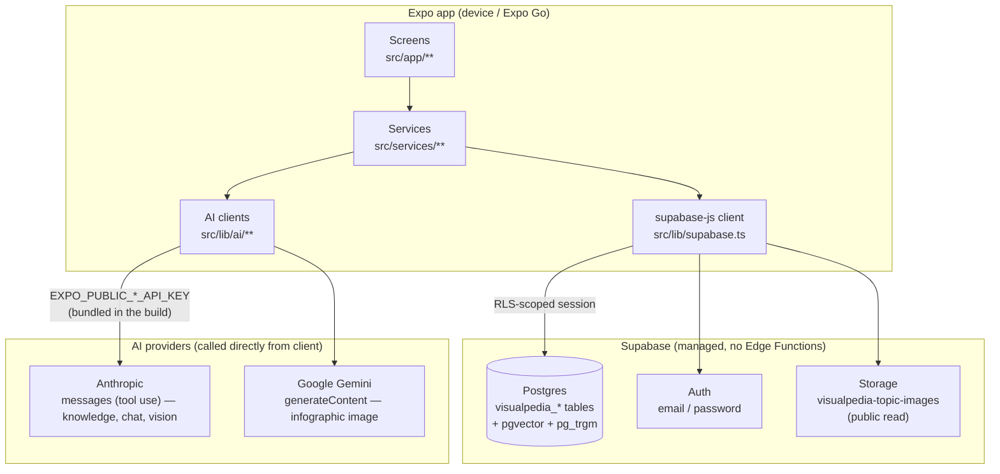
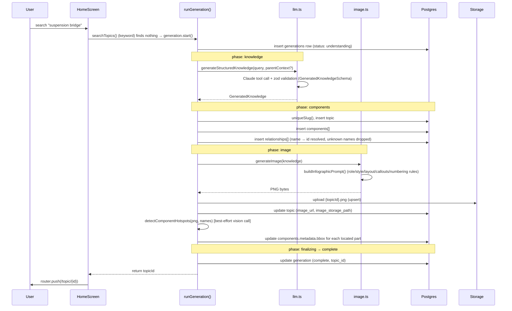
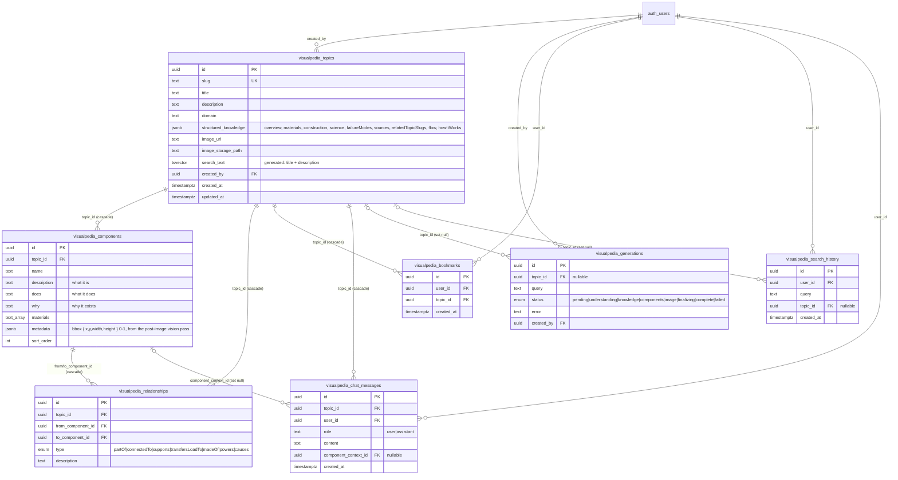
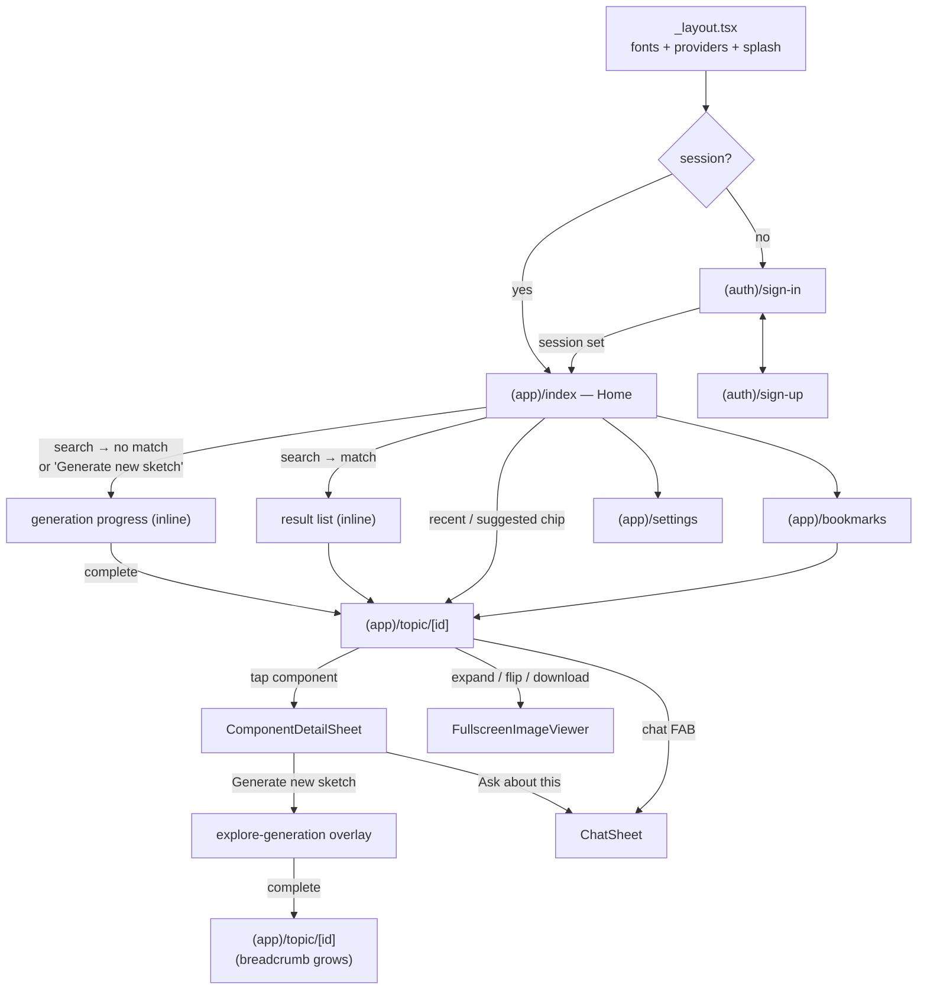
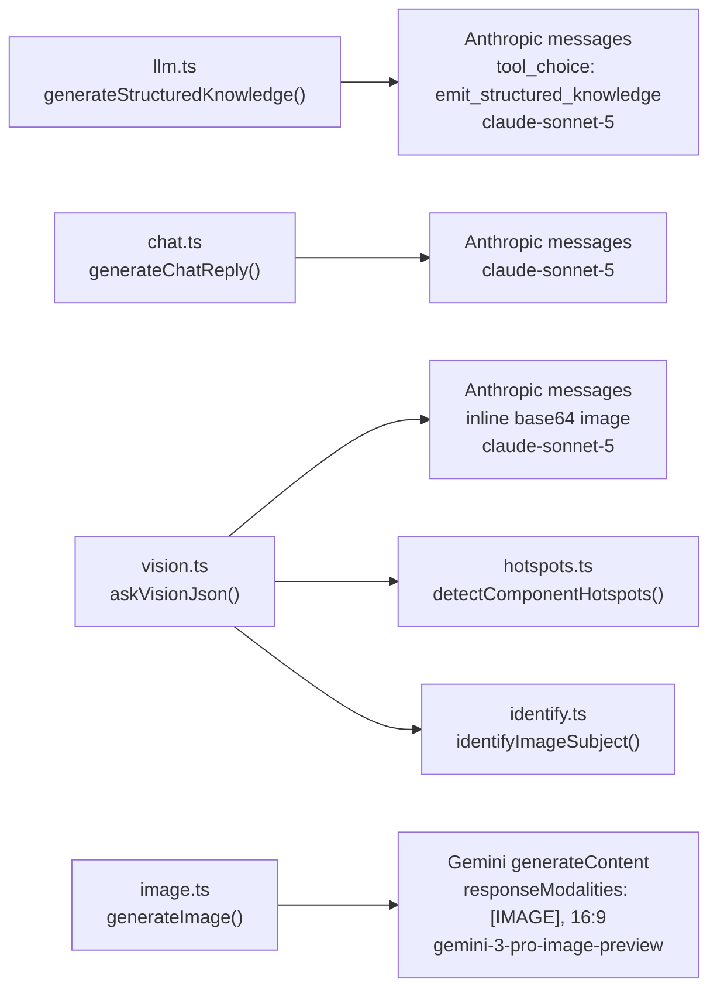
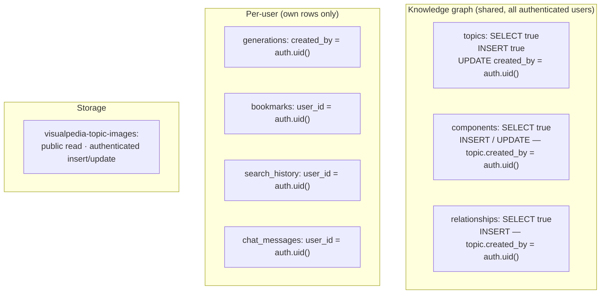

# Architecture

Loupe is an Expo / React Native app with **no backend of its own**. Supabase
provides Postgres, Auth, and Storage; every AI call goes straight from the client to
Anthropic (knowledge, chat, vision) or Google Gemini (image) over plain `fetch`. The
signed-in user's RLS-scoped session is the only thing standing between the client and the
database.

This document is the map. For the *why* behind the no-backend trade-off see
[`AGENTS.md`](../AGENTS.md); for the user-facing feature walk-through and setup steps see
[`README.md`](../README.md); for the design tokens see [`DESIGN.md`](../DESIGN.md).

- [System context](#system-context)
- [The generation pipeline](#the-generation-pipeline)
- [Data model](#data-model)
- [Screen & navigation flow](#screen--navigation-flow)
- [AI models](#ai-models)
- [Row-level security](#row-level-security)
- [Error handling & retry](#error-handling--retry)
- [State management](#state-management)
- [Known gaps](#known-gaps)

---

## System context



**Keys live in the bundle.** `EXPO_PUBLIC_*` vars are inlined by Expo at build time and are
visible to anyone who unpacks the installed app. This is a deliberate, documented trade-off
(see `AGENTS.md`) and must be revisited before any public release.

---

## The generation pipeline

`runGeneration()` in [`src/services/generation.ts`](../src/services/generation.ts) runs the
whole search → knowledge → image flow in-process. There is no server job and no Realtime
subscription: the function reports each phase through an `onPhase` callback that
[`useGeneration`](../src/hooks/use-generation.ts) mirrors into React state.



### Phases

| Phase          | What happens                                                          | Failure behaviour |
| -------------- | -------------------------------------------------------------------- | ----------------- |
| `understanding`| Vestigial — emitted so the progress UI has a first step; no work happens here (it used to run the embedding dedup check) | — |
| `knowledge`    | Claude tool call returning schema-validated `GeneratedKnowledge`    | Throws; `ApiError.retryable` set for 429 / 5xx |
| `components`   | Insert topic + components + relationships                            | Throws (RLS / network); generation row → `failed` |
| `image`        | Build prompt, generate PNG (Gemini), upload, write URL back, then a best-effort vision pass to locate each component's box on the cutaway (`src/lib/ai/hotspots.ts` → `components.metadata.bbox`) | Image failure throws (`retryable` for 429 / 5xx); hotspot failure is a silent no-op |
| `finalizing`   | Mark the `generations` row complete                                 | — |
| `complete`     | Return `topic.id`                                                   | — |

Entry points beyond a plain search:

- **Scan an object** — the Home "Scan an object with your camera" button opens the `camera`
  route ([`src/app/(app)/camera.tsx`](../src/app/(app)/camera.tsx)), a full-screen modal
  wrapping `expo-camera`'s `CameraView` (front/back toggle, shutter, plus a "choose a photo"
  fallback via `expo-image-picker` for when the camera can't start -- common in Expo Go, whose
  own QR scanner holds the back camera). On capture it downscales the photo
  (`expo-image-manipulator`, long edge 1024, JPEG q0.6), `identifyImageSubject()`
  asks the vision model for the canonical name, that term is stashed in
  [`src/state/pending-scan.ts`](../src/state/pending-scan.ts), and the screen pops back to
  Home, which reads it on focus and feeds it into the same search → `runGeneration` flow. A
  photo with no nameable subject, or a vision `ApiError`, stays on the camera screen with a
  retake prompt and never starts a generation.
- **Drill-down** — `ComponentDetailSheet` → `runGeneration(name, parentContext)`. The parent
  topic's description is passed as `context` so the child infographic keeps the same domain,
  scale, and terminology (`buildUserPrompt` in `llm.ts`).
- **Backfill** — `ensureTopicImage()` regenerates a missing image for a topic whose earlier
  generation died after the DB writes but before the image. Rebuilds the prompt from the
  stored `structured_knowledge` since the original `imagePrompt` isn't persisted.

---

## Data model

DB rows are `snake_case`; app types ([`src/types/knowledge.ts`](../src/types/knowledge.ts))
are `camelCase`. Conversion is centralised in
[`src/lib/db-mappers.ts`](../src/lib/db-mappers.ts) — never hand-rolled in a component.
Table / bucket / RPC names come from [`src/lib/tables.ts`](../src/lib/tables.ts).



### Indexes & extensions

- Full-text search uses the generated `tsvector` `search_text` column (title + description)
  with a GIN index, queried `type: 'websearch'`. `pg_trgm` is enabled.
- Per-topic child lookups (`components`, `relationships`, `chat_messages`) and per-user
  lookups (`bookmarks`, `search_history`) are all indexed.
- `pgvector` is still installed (shared across apps) but nothing in this app uses it — the
  `embedding` column and its HNSW index were dropped in `20260909000000_drop_embeddings.sql`.

### `structured_knowledge` (jsonb)

Not a separate table — a blob on `visualpedia_topics`. Shape is `StructuredKnowledge` in
`src/types/knowledge.ts`: `overview`, `materials[]`, `construction[]`, `science`,
`failureModes[]`, `sources[]`, `relatedTopicSlugs[]`, `flow[]`, `howItWorks`. Topics created
before `howItWorks` / `flow` existed won't have them; the topic screen falls back
(`howItWorks` prose → `flow` chain → "No explanation available").

### Migrations

Apply in order from `supabase/migrations/`:

| Migration | What it does |
| --- | --- |
| `20260811035143_init_schema.sql` | Schema + initial RLS + storage bucket + full-text search |
| `20260811050231_component_narrative_fields.sql` | Split `purpose` into `does` / `why` |
| `20260811055049_client_write_access.sql` | Client-write-access RLS policies |
| `20260827000000_related_topics_rpc.sql` | `visualpedia_related_topics` RPC (later dropped) |
| `20260828000000_embedding_provider.sql` | `embedding_provider` column (later dropped) + the `visualpedia_components` `UPDATE` policy the hotspot pass needs |
| `20260909000000_drop_embeddings.sql` | Drops the `embedding` / `embedding_provider` columns and the `visualpedia_match_topics` / `visualpedia_related_topics` RPCs |

> The init migration's comments still say writes go through Edge Functions with the
> service-role key, and it adds `visualpedia_generations` to the `supabase_realtime`
> publication — both predate the move to client-side generation. `client_write_access`
> supersedes the RLS comment; nothing subscribes to the Realtime publication. Left as-is —
> rewriting an applied migration is worse than a stale comment.

---

## Screen & navigation flow

Routes live under `src/app` (`expo-router` is pointed there instead of the default `app/`).
Two route groups gate on the Supabase session.



The topic screen has two layouts: the normal 5-tab view (Components / How it works / Build /
Engineering / Sources), and a `isMinimal` fallback for leaf topics the LLM returned with
zero components (a single bolt, a single wire).

---

## Project structure

Routes live under `src/app` (`expo-router` is pointed there instead of the default `app/`).

```
src/
├── app/
│   ├── (auth)/            sign-in, sign-up — unauthenticated stack
│   └── (app)/             authenticated stack, redirects to sign-in if no session
│       ├── index.tsx      home: search, camera scan, suggested + recent topics, generation UI
│       ├── camera.tsx     full-screen modal: expo-camera capture → identify → hand back to home
│       ├── topic/[id].tsx topic detail: image + hotspots, 5 tabs, chat, drill-down
│       ├── bookmarks.tsx  saved topics
│       └── settings.tsx   theme, AI-model info (read-only), sign out
├── components/            chat-sheet, component-detail-sheet, flow-chain, zoomable-image,
│                          generation-progress, themed-text/-view, tabs, toast, etc.
├── constants/theme.ts     spacing / radii / colors — dynamic light/dark/system theming
├── hooks/                 use-generation, use-theme, use-toast
├── lib/
│   ├── ai/                llm.ts, image.ts, chat.ts, vision.ts, hotspots.ts, identify.ts,
│   │                      errors.ts — all provider fetch calls + ApiError / retryable
│   ├── db-mappers.ts      snake_case ⇄ camelCase conversion
│   ├── slug.ts            unique slug generation for new topics
│   ├── supabase.ts        Supabase client, large-session-safe SecureStore / AsyncStorage
│   ├── tables.ts          Tables / Buckets name constants
│   └── logger.ts          structured, level-gated, secret-redacting logger
├── services/              generation.ts (the pipeline), search.ts, topics.ts, bookmarks.ts,
│                          history.ts, chat.ts — one file per DB concern
├── state/                 auth-context (Supabase session), theme-store, pending-scan
└── types/knowledge.ts     app-level camelCase types
```

### Auth & session storage

Supabase Auth (email / password). Sessions persist through a custom `LargeSecureStore`
([`src/lib/supabase.ts`](../src/lib/supabase.ts)): `expo-secure-store` rejects values over
~2KB but a Supabase session can exceed that, so the session lives in `AsyncStorage` encrypted
with an AES-256-CTR key that SecureStore holds — Supabase's documented pattern for Expo.

### Fonts

Fonts come from `@expo-google-fonts` — Space Grotesk (display / headings), Inter (body / UI),
JetBrains Mono (labels, breadcrumbs, specs, formulas), loaded via `useFonts()` in
`src/app/_layout.tsx`. The `Fonts` map in `src/constants/theme.ts` must stay in sync with the
families registered in that `useFonts()` call, or RN silently falls back to the system font.
Token values are in [`DESIGN.md`](../DESIGN.md).

---

## AI models

One provider per job, fixed at build time — no runtime switch, no per-model env override, no
Settings toggle. The model names are exported constants; the Settings screen displays those
same constants so a shown model name can't drift from what's sent on the wire.



| Concern              | Model | Notes |
| -------------------- | ----- | ----- |
| Structured knowledge | Claude `claude-sonnet-5` (`TEXT_MODEL`) | Forced tool call against the shared `KNOWLEDGE_JSON_SCHEMA`; every response re-validated against the `zod` `GeneratedKnowledgeSchema` before it can touch the DB. |
| Chat replies         | Claude `claude-sonnet-5` (`TEXT_MODEL`) | System prompt scoped hard to the current topic + optional component. |
| Vision (scan / hotspots) | Claude `claude-sonnet-5` (`TEXT_MODEL`) | `vision.ts` → `askVisionJson()` sends an inline base64 image. `hotspots.ts` locates component boxes on the finished infographic (best-effort, non-fatal); `identify.ts` names the subject of a camera photo so Home can run it through the normal pipeline (see [The generation pipeline](#the-generation-pipeline) — the "scan an object" entry point). |
| Infographic image    | Gemini `gemini-3-pro-image-preview` (`IMAGE_MODEL`) | "Nano Banana Pro" — its label/text rendering is materially better than the 2.5 Flash tier, which matters since every callout is on-image text. Gemini has no alpha channel, so the prompt asks for a plain white background (a plain-text "transparent" request makes Gemini draw a checkerboard). |

**Search is keyword-only** (`search.ts` — Postgres full-text over `search_text`). Semantic
search, near-duplicate detection, and the embedding-driven "Suggested topics" section were
removed with the move to Claude (no embeddings API); `20260909000000_drop_embeddings.sql`
drops the pgvector column and RPCs.

---

## Row-level security

Migrations: `20260811035143_init_schema.sql` (schema + read policies),
`20260811055049_client_write_access.sql` (write policies, added when generation moved
client-side), `20260828000000_embedding_provider.sql` (adds the `visualpedia_components`
`UPDATE` policy the hotspot pass needs — it also added an `embedding_provider` column, later
dropped), `20260909000000_drop_embeddings.sql` (drops the `embedding` columns and the
`visualpedia_match_topics` / `visualpedia_related_topics` RPCs).



The component / relationship `INSERT` policies check *ownership of the target topic*
(`exists (select 1 from visualpedia_topics t where t.id = topic_id and t.created_by =
auth.uid())`), not bare `to authenticated` — that closes an IDOR where any signed-in user
could attach rows to someone else's topic. There is **no server-side moderation** of
generated content beyond the `zod` schema check.

The post-image hotspot pass writes `components.metadata.bbox` via
`visualpedia_components UPDATE`. The `20260828000000` migration adds the matching
`components UPDATE` policy — scoped like the `INSERT` one (the component's topic must belong
to the caller) — since the init migration only granted `INSERT`. Without that migration
applied, RLS silently drops the bbox writes (0 rows, no error).

---

## Error handling & retry

[`src/lib/ai/errors.ts`](../src/lib/ai/errors.ts) is the choke point. Every non-2xx AI
response goes through `throwCleanApiError()`, which logs the raw body and throws an
`ApiError` carrying `scope` (`llm` / `image` / `chat`), `provider`, `status`, and
`retryable`.

```mermaid
flowchart TD
    call["AI fetch"] --> ok{response.ok?}
    ok -->|yes| parse["parse + zod validate"]
    ok -->|no| clean["throwCleanApiError()"]
    clean --> quota{insufficient_quota?}
    quota -->|yes| perm["ApiError retryable=false\n'out of billing quota'"]
    quota -->|no| code{429 or 5xx?}
    code -->|yes| trans["ApiError retryable=true"]
    code -->|no| perm2["ApiError retryable=false\n(401/403 → 'check the API key')"]

    trans --> ui["useGeneration: setRetryable(true)"]
    ui --> retry["retry(): resubmit the same request"]
    retry --> call
```

- The **user-facing** message is always short and provider-agnostic
  (`GENERIC_ERROR_MESSAGE`, or a `friendlyMessage()` variant). The raw provider blob only
  goes to the logger and `generations.error`.
- `retry()` resubmits the last request unchanged; a 429/5xx is treated as transient and the
  UI shows a one-tap retry, a permanent error (bad key, quota) is not retryable.
- The best-effort hotspot vision call passes `{ silent: true }` so a persistent failure
  doesn't re-log the full provider body on every generation.

---

## State management

| Concern            | Mechanism | File |
| ------------------ | --------- | ---- |
| Auth session       | React context over `supabase.auth` + `onAuthStateChange` | `src/state/auth-context.tsx` |
| Theme preference   | Module-level singleton + `Appearance` listener + `AsyncStorage` | `src/state/theme-store.ts` |
| Server data        | TanStack Query (`retry: 1`, `staleTime: 30s`); `useFocusEffect` invalidates recent topics | screens |
| In-flight generation | `useGeneration` hook (local `useState` + `useRef` for the last request) | `src/hooks/use-generation.ts` |
| Pending camera scan | Module-level one-shot handoff from the camera screen to Home | `src/state/pending-scan.ts` |
| Toast              | Context + single-timeout ref | `src/hooks/use-toast.tsx` |

The theme store predates any need for a React 18 concurrent-safe store and uses the
hand-rolled listener-set + `useSyncExternalStore` pattern rather than a library.

---

## Testing

`npm test` runs Jest (`jest-expo` preset). Coverage is deliberately on the pure logic that
would fail quietly in production: `toSlug`, the `db-mappers`, `throwCleanApiError`'s
retryable/quota classification, `clampBox`, and `identify.ts`'s `normalizeIdentification` /
`cleanLabel`. UI components and the network paths in `src/lib/ai/*` are not covered.

## Known gaps

Tracked in [`README.md` → Known limitations](../README.md#known-limitations--open-items).
The load-bearing ones:

1. **Client-bundled API keys** — the whole no-backend design. Revisit before public release.
2. **No content moderation** before AI output is written to the shared knowledge graph.
3. **Hotspot detection is best-effort and adds a vision call per generation** — quality
   depends on the model actually placing boxes correctly on its own output; misses just mean
   fewer tappable regions. Needs the `20260828` migration applied for the writes to stick.
4. **No semantic search** — search is Postgres full-text only, so there's no near-duplicate
   detection (the same subject can be generated twice) and no personalized "Suggested topics".
   Embeddings will return via a non-OpenAI mechanism.
